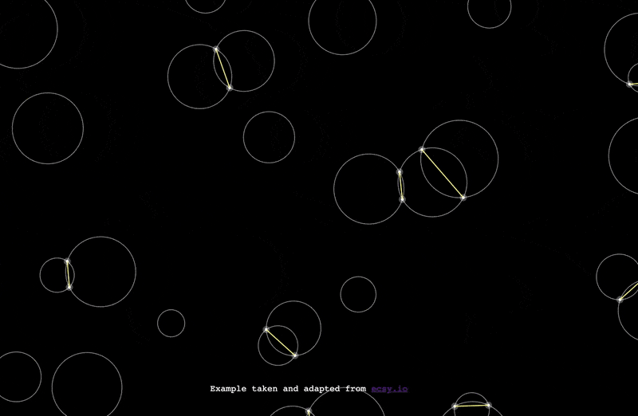

# flecs

> 🚧 Flecs is a work-in-progress and might be unstable, use it at your
> own risks 🚧

Fast & Flexible EntityComponentSystem (ECS) for JavaScript and Typescript, available in browser and Node.js.

Get started with:
* The [Documentation](./doc.md)
* The [Examples](./examples)

> 🔍 I am currently looking for people to help me to identify their needs in order to drive the development of this [library further](#stable-version).

<p align="center">
  
</p>

## Philosophy

Flecs is heavily based on [Ecsy](https://github.com/ecsyjs/ecsy), but mixes concepts from other great ECS. It also share some concepts with
[Hecs](https://github.com/gohyperr/hecs/).

My goals for the library is to keep it:

* 💻 Framework Agnostic 💻
* 🪶 Lightweight 🪶
* ⚡ Fast ⚡
* 🏋️ Robust 🏋️

The library will prioritize stability improvements over feature development.

## Features

* Easy To Use Query Language
* System Grouping
* System Topological Sorting
* Automatic Component Registration
* TypeScript Decorators
  * For component properties
  * For system ordering and configuration

## Usage Example

```js
class Component {}
```

## Stable Version

The library is brand new and it's the perfect time for me to taylor it to match as much as possible most of the developer needs.

I want to open discussion about the following topics:
* Deferred creation and removal of components
* Deferred creation and removal of entities
* Command buffers
* Query system improvement
  * New selector (`Modified`? `Removed`?)
* Is a `StateComponent` component needed?

Please feel free to reach out directly in the [Github Issues](https://github.com/DavidPeicho/flecs/issues) or contact me on [Twitter](https://twitter.com/DavidPeicho) to discuss those topics.

## Benchmarks

TODO

## Contributing

For detailed information about how to contribute, please have a look at the [CONTRIBUTING.md](./CONTRIBUTING.md) guide.
